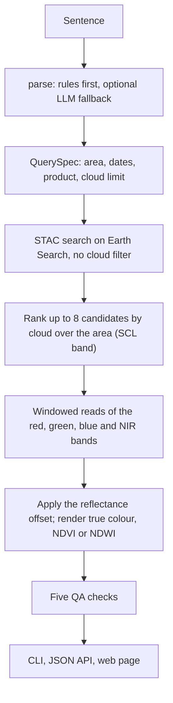
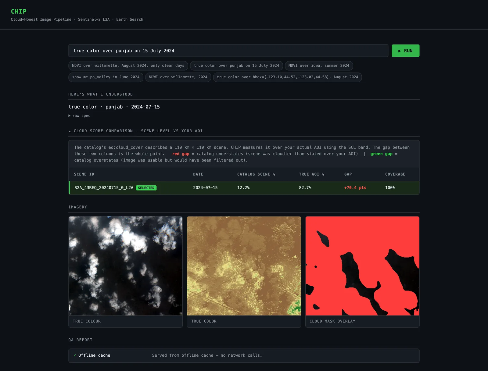
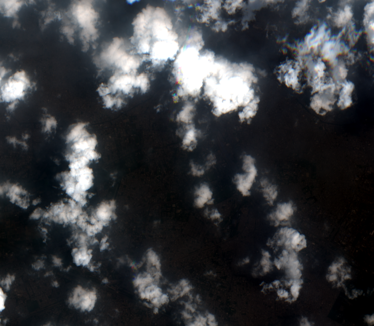
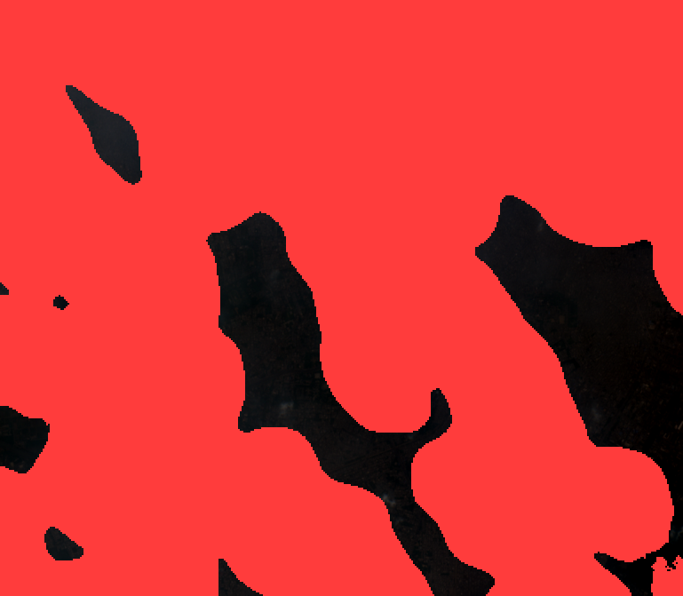
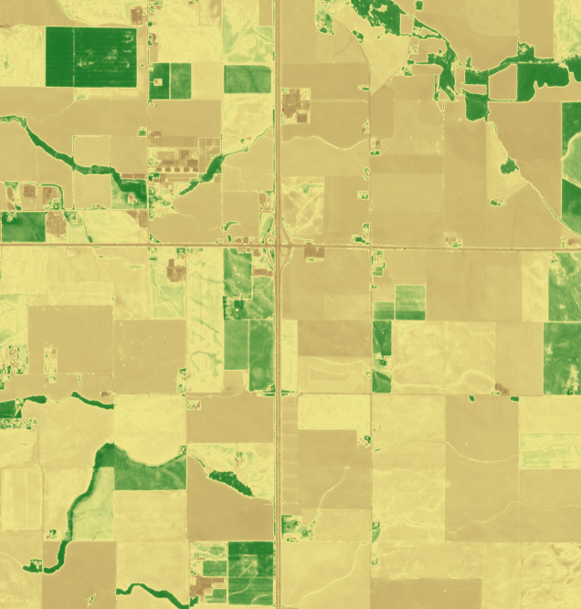
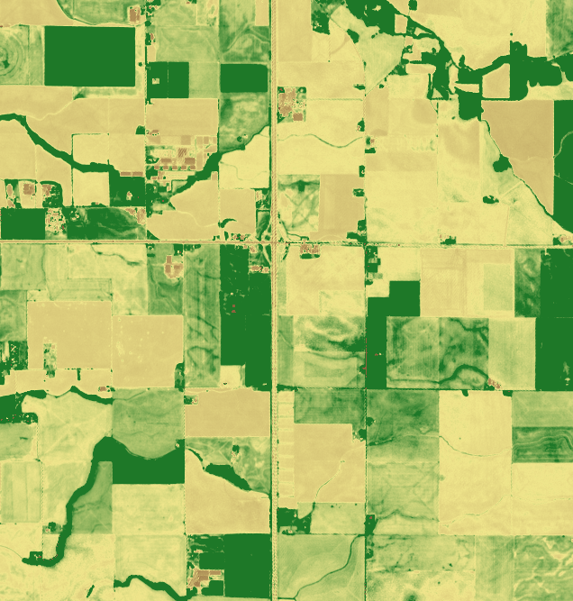

# CHIP — Cloud-Honest Image Pipeline

> *Not "search is slow" — "search is confidently incorrect."*

> **Hackathon build.** A solo entry for a "Fix It" track (take something broken and fix it), with a 90-minute build
> budget. I framed the problem, measured the two example scenes, prepared the demo data and wrote the build spec
> ([`BOB.md`](BOB.md), [`PLAN.md`](PLAN.md)). A coding agent ("Bob") wrote the application code from that spec, ticket
> by ticket ([`work-log.md`](work-log.md)). Case study:
> [silentashish.com/projects/cloud-honest-image-pipeline](https://www.silentashish.com/projects/cloud-honest-image-pipeline)
> (live once published).

CHIP is a natural-language satellite imagery pipeline that fixes two silent bugs present in virtually every Sentinel-2 workflow written since 2022: **scene-level cloud filtering that doesn't apply to your AOI**, and **a reflectance encoding offset that shifts mean NDVI by 40%** with no error or warning.

---

## The Problem

Every remote-sensing pipeline filters scenes by `eo:cloud_cover`. That number describes a **110 km × 110 km** Sentinel-2 tile. Your area of interest is rarely more than 5–10 km wide. The filter has no idea where you are actually looking.

| Scene | Catalog `eo:cloud_cover` | True AOI cloud | Consequence |
|-------|--------------------------|----------------|-------------|
| **Punjab, 15 Jul 2024** | 12.2% — passes every filter | **82.7%** | Analyst computes NDVI from cloud tops, not crops. No error raised. |
| **Willamette, 2 Aug 2024** | 47.4% — rejected by every filter | **1.9%** | A perfect image is thrown away. Analyst never knew it existed. |

A second silent bug: since ESA processing baseline 04.00 (January 2022) the correct formula is `(DN − 1000) / 10000`, not `DN / 10000`. On the clear Willamette scene this produces mean NDVI **0.299** instead of the correct **0.497** — a 40% underestimate that looks completely plausible.

---

## The Fix in One Sentence

```
NDVI over willamette, August 2024, only clear days
```

CHIP parses that sentence, searches the full catalog without a cloud filter, scores each candidate scene over **your exact AOI** using the SCL band, picks the winner by the honest number, applies the correct reflectance offset, and returns a QA report that names every silent error the standard workflow would have made.

---

## Demo

```bash
# Clone and install
git clone https://github.com/silentashish/Cloud-Honest-Image-Pipeline
cd Cloud-Honest-Image-Pipeline
uv venv --python 3.12 && uv pip install -r requirements.txt

# Start the web UI
uv run uvicorn app.main:app --reload
# → open http://localhost:8000
```

Click any example query chip or type your own. The comparison table — catalog `scene %` next to true `AOI %` — is the argument.

**No network? Use offline mode** (pre-warmed hero scenes, zero HTTP calls):
```bash
CHIP_OFFLINE=1 uv run uvicorn app.main:app --reload
```

**CLI only:**
```bash
uv run python -m app.cli "NDVI over willamette, August 2024, only clear days"
```

---

## Example Queries

```
NDVI over willamette, August 2024, only clear days
true color over punjab on 15 July 2024
NDVI over iowa, summer 2024
show me po_valley in June 2024
NDWI over willamette, 2024
true color over bbox=[-123.10,44.52,-123.02,44.58], August 2024
```

---

## How It Works



In more detail:

```
sentence
  → parse()              deterministic regex · optional watsonx/Granite fallback
  → QuerySpec
  → pipeline.run()
      → search_items()       STAC POST, no cloud filter
      → rank_candidates()    SCL window read per candidate (≤8 scenes)
      → read bands           red / green / blue / nir (10 m) · scl (20 m)
      → product rendering    true_color / ndvi / ndwi PNG
      → run_checks()         5 QA checks
  → ChipResult           → CLI printout / FastAPI JSON / web UI
```

### Five QA Checks

| Check | What it catches |
|-------|-----------------|
| `reflectance_offset` | BOA_ADD_OFFSET impact — what NDVI would have been without it |
| `aoi_cloud_vs_scene` | Catalog cloud disagrees with AOI measurement by >15 pts, direction named |
| `nodata_as_zero` | `nodata=0` while 0 is also a valid DN — statistics biased low |
| `crs_note` | Output CRS confirmed, no raster reprojection performed |
| `valid_pixels` | Fails if <50% of AOI has valid pixels (swath edge) |

---

## Architecture

```
app/
  __init__.py     env vars, constants (BOA_ADD_OFFSET, SCL_CLOUD_CLASSES)
  models.py       QuerySpec · Candidate · Check · ChipResult  (pure dataclasses)
  parse.py        sentence → QuerySpec  (rules + optional LLM)
  search.py       STAC search · AOI cloud fraction · candidate ranking
  chip.py         COG window reads · band processing · PNG/GeoTIFF output
  qa.py           5 QA checks
  pipeline.py     orchestration · in-process cache · offline mode
  main.py         FastAPI  (GET /api/aois · POST /api/parse · POST /api/chip)
  cli.py          terminal entry point
web/
  index.html      single-file dark UI, no framework, no build step
demo/
  aois.geojson    4 named AOIs with bboxes
  queries.txt     6 example queries
  cache/          pre-fetched STAC items + evidence.json
  assets/         pre-generated PNGs for offline mode
```

---

## Screenshots



*Offline mode, Punjab scene. Contains modified Copernicus Sentinel data 2024.*

| Punjab, 15 Jul 2024: true colour and cloud mask | Willamette, 2 Aug 2024: NDVI without and with the offset |
| --- | --- |
|   |   |

---

## Stack

| Package | Purpose |
|---------|---------|
| `rasterio >= 1.4` | COG windowed reads, CRS transforms |
| `numpy >= 2.0` | Band arithmetic |
| `pillow >= 10.0` | PNG output, SCL mask upsampling |
| `requests >= 2.32` | STAC HTTP calls |
| `fastapi >= 0.115` | Web API |
| `uvicorn >= 0.30` | ASGI server |
| `pytest >= 8.0` | Acceptance tests |

No geopandas. No xarray. No database. No Docker. No frontend build step.

---

## Reproducibility

All numbers in this repo are reproducible from real Sentinel-2 L2A COGs on AWS:

```bash
# Reproduce cloud scoring findings
uv run python demo/reproduce_scan.py

# Reproduce pre-generated assets
uv run python demo/reproduce_assets.py

# Run acceptance tests (requires live internet)
uv run pytest tests/ -v
```

These are **two hand-picked example scenes** (n = 2). They show that the failure happens, not how often. On
2026-09-24 (UTC), a fresh clone reproduced them exactly: 7/7 tests passed, `aoi_cloud_fraction` returned 12.23 → 82.65
and 47.44 → 1.89, mean NDVI came out 0.2989 → 0.4974, and `reproduce_assets.py` regenerated every file in `demo/`
byte-for-byte.

Golden numbers asserted in the test suite:

```
Punjab    scene=12.2%  →  AOI=82.7%   (false-clear: passes every filter, image is cloud)
Willamette  scene=47.4%  →  AOI=1.9%  (wrongly rejected: perfect image, thrown away)
NDVI naive=0.299  →  correct=0.497    (Δ > 0.15 from missing BOA offset)
```

---

## Known issues

- **Images don't load in live (non-offline) mode.** The page builds image URLs by splitting on `/outputs/`, but the API
  returns relative `outputs/…` paths. Diagnosis and reproduction: [`image-not-loading.md`](image-not-loading.md).
  Offline mode is unaffected.

---

## Environment Variables

| Variable | Default | Purpose |
|----------|---------|---------|
| `CHIP_OFFLINE` | unset | Set to `1` to serve hero cases from `demo/` with zero network calls |
| `WATSONX_API_KEY` | unset | Enables optional Granite LLM parser path (falls back to rules if unset or on any error) |
| `WATSONX_PROJECT_ID` | `""` | watsonx project ID (only needed with `WATSONX_API_KEY`) |
| `WATSONX_URL` | `https://us-south.ml.cloud.ibm.com` | watsonx endpoint |

---

## License

MIT
